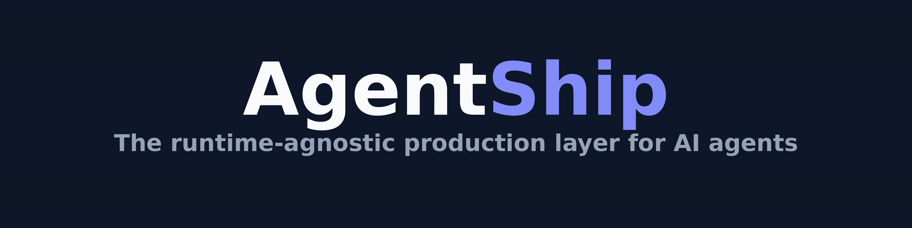
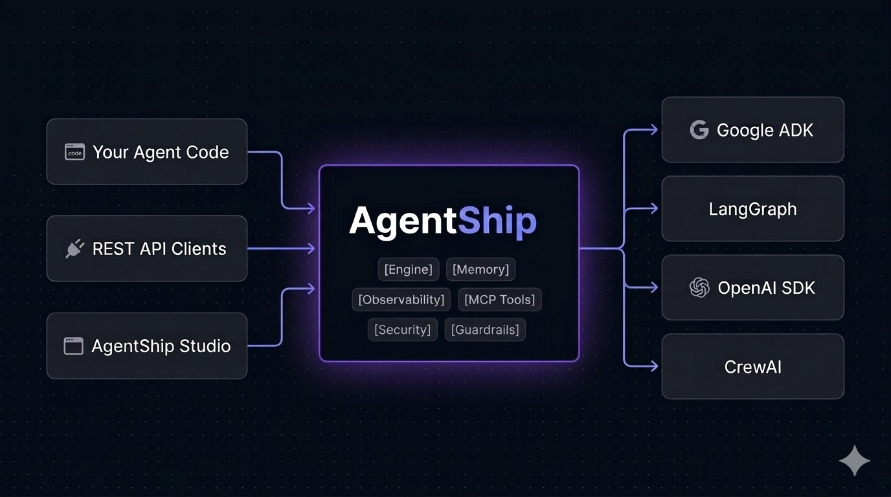

<p align="center">
  
</p>

<p align="center">
  Author an agent — or a team of agents — in YAML or Python.<br>
  Get the production stack wired for you: tools, memory, tracing, streaming, and a served API.
</p>

<p align="center">
  <a href="https://pypi.org/project/agentship-sdk/"></a>
  <a href="https://www.python.org/"></a>
  <a href="https://www.langchain.com/langgraph"></a>
  <a href="https://modelcontextprotocol.io/"></a>
  <a href="https://opentelemetry.io/"></a>
  <a href="LICENSE"></a>
</p>

---

## The problem

Your agent works in a notebook. Shipping it means a REST API, session storage, tracing that
reports real token costs, streaming with its error cases, and packaging. That is a couple of
thousand lines of infrastructure with nothing to do with what your agent *does* — and you
rebuild it for the next one.

The usual answer is a framework that owns everything. Then you are inside it, and the day
you need something it lacks, you are rewriting.

> **AgentShip integrates best-of-breed libraries behind small, stable seams.**
> LangGraph runs the graph. LiteLLM talks to models. MCP supplies tools. OpenTelemetry
> carries traces. We reimplement none of them — we wire them together and add the plumbing
> none of them ship.

<p align="center">
  
</p>

---

## Quick start

```bash
pip install "agentship-sdk[starter,observability]"
```

One agent, one tool:

```yaml
# calc.yaml
name: calculator-agent
engine: langgraph
model: openai/gpt-4o-mini
prompt: Use the calculator for arithmetic. Answer with just the number.
tools: [calculator]
```

```bash
agentship run calc.yaml --input "What is 17 times 23?"
# 391
```

A team, with a coordinator that routes on each member's `description`:

```yaml
# team.yaml
name: research-team
engine: langgraph
model: openai/gpt-4o-mini
members:
  - name: analyst
    description: arithmetic, comparisons, and calculations over known numbers
    model: openai/gpt-4o-mini
    prompt: Answer with the number and one short sentence.
  - name: writer
    description: explanations, summaries, and anything needing prose
    model: anthropic/claude-sonnet-4-6
    prompt: Answer in two clear sentences.
```

A member can be inline like this, a `ref:` to its own YAML file, or a networked agent
reached over A2A. Each runs as its own turn, nested inside the coordinator's trace.

```bash
agentship serve --agents-dir .     # /v1 REST + SSE + WebSocket, and Studio at /studio
```

**No API key?** The `echo` engine runs offline, so the transports, auth, error model and
Studio are all explorable for free:

```yaml
name: hello
engine: echo
prompt: A stand-in agent that needs no provider.
```

---

## What you get

**Multi-agent.** A coordinator classifies the request against each member's `description`,
dispatches, and merges the result. Members nest properly in the trace — a sub-agent's model
and tool calls appear beneath it, not in a separate trace.

**Tools and MCP.** Built-in tools (`calculator`, `web_search`, `scrape_url`), your own
Python functions, and any MCP server — stdio or streamable HTTP — through
`langchain-mcp-adapters`. An MCP tool and a native one are indistinguishable to the graph.

**Memory and durability.** Short-term conversation memory by default; PostgreSQL
checkpoints when a run needs to survive a restart. A run that pauses for a human returns a
resume token, and `POST /v1/agents/{name}:resume` continues it.

**Observability that shows the money.** One OpenTelemetry span tree per turn:

```
agent triage
  node.classify
    chat openai/gpt-4o-mini      in=43  out=1   $0.000007
  agent billing_specialist
    chat openai/gpt-4o-mini      in=43  out=54  $0.000039
```

Spans are named after the thing that ran — `agent <name>`, `chat <model>` — rather than
`agent` and `model`, so a backend's list is readable. Turns carry `thread_id`, so a
conversation groups into one thread instead of scattering into unrelated traces. Exports to
Opik, LangFuse, LangSmith or Phoenix: set `AGENTSHIP_OTEL_EXPORTERS` and the credentials,
and nothing in your spec changes.

**Reasoning models.** `reasoning_effort: minimal | low | medium | high` — one knob, mapped
by LiteLLM onto whichever scale the provider uses. Thinking arrives on its own `reasoning`
stream frame, never mixed into the answer, and reasoning tokens are recorded separately so
a turn that cost 5× shows why.

**Serving.** `/v1` REST, SSE streaming, WebSocket, RFC-9457 problem documents, API-key or
JWT auth, per-tenant isolation, and validated structured output when a spec declares an
`output_schema`.

**Studio, built in.** A chat and trace UI at `/studio`, served by the same process — one
self-contained HTML file, no build step and no CDN. It shows what the agent is doing while
it works, rather than a spinner:

```
✓ Thinking…
✓ Calling web_search…
✓ Reading web_search result…
  the answer
```

---

## Packages

Six distributions, released together, one version. Install only what you need.

| Package | What it is |
|---|---|
| [`agentship-sdk`](https://pypi.org/project/agentship-sdk/) | The batteries-included meta-package |
| [`agentship-core`](https://pypi.org/project/agentship-core/) | The vendor-free kernel: spec, runtime, registry, middleware, `echo` engine |
| [`agentship-langgraph`](https://pypi.org/project/agentship-langgraph/) | The reference engine — compiles a spec into a LangGraph `StateGraph` |
| [`agentship-service`](https://pypi.org/project/agentship-service/) | The FastAPI app behind `/v1`, plus Studio |
| [`agentship-observability`](https://pypi.org/project/agentship-observability/) | The OpenTelemetry pipeline and its exporters |
| [`agentship-cli`](https://pypi.org/project/agentship-cli/) | `agentship run`, `serve`, `verify`, `doctor`, `init` |

`agentship-core` imports no vendor library. That is what keeps the seams honest: the engine
can be replaced without touching the kernel, and a conformance matrix fails the build if an
engine declares a capability it does not actually have.

```bash
pip install "agentship-sdk[starter,observability]"   # the usual stack
pip install "agentship-sdk[all]"                     # everything
pip install "agentship-langgraph[mcp]"               # MCP tools
pip install "agentship-core[postgres]"               # durable checkpoints
```

---

## Commands

```bash
agentship init my-project              # scaffold a project
agentship new-agent support            # scaffold one agent from a template
agentship run agent.yaml               # one turn, printed
agentship serve --agents-dir agents    # the /v1 API + Studio
agentship doctor                       # validate every spec against its engine
agentship verify                       # prove engines honour what they declare
agentship db upgrade                   # apply checkpoint migrations (gated)
```

`doctor` and `verify` exist because a capability an engine *declares* and one it actually
*has* are different things. `verify` fails the build when they diverge.

---

## Reference

| | |
|---|---|
| Capability guides | [`docs/capabilities/`](docs/capabilities/) — [multi-agent](docs/capabilities/multi-agent.md) · [tools & MCP](docs/capabilities/tools-and-mcp.md) · [observability](docs/capabilities/observability.md) · [service & security](docs/capabilities/service-and-security.md) · [checkpointing & HITL](docs/capabilities/checkpointing-and-hitl.md) · [durable resume](docs/capabilities/durable-resume.md) |
| Architecture decisions | [`docs/decisions/`](docs/decisions/) — why we integrate rather than reimplement |
| Runnable examples | [`examples/`](examples/) |
| Releasing and versioning | [`docs/RELEASING.md`](docs/RELEASING.md) |
| Deploying | [`deploy/RAILWAY.md`](deploy/RAILWAY.md) |
| API collection | [`postman/`](postman/) |
| Contributing | [`CONTRIBUTING.md`](CONTRIBUTING.md) |
| Changelog | [`docs/CHANGELOG.md`](docs/CHANGELOG.md) |

---

## Status

**Early — `0.x`, so the API can change between minor versions.** Pin exactly if that matters
to you (`agentship-sdk==0.0.1`).

> **Known issue in 0.0.1.** `pip install "agentship-sdk[starter]"` on its own cannot run an
> agent: tracing is on by default and the observability adapter is not in that extra, so
> every run fails with `observability provider 'otel' is not installed`. Install
> `[starter,observability]` as shown above. Fixed on `main`; ships in 0.0.2.

Rebuilt foundation-first: one thin working slice per phase, with tests and a runnable demo
before anything is called done. Test first, one task per commit, CI green — see
[CONTRIBUTING](CONTRIBUTING.md).

## Licence

[Apache 2.0](LICENSE).
