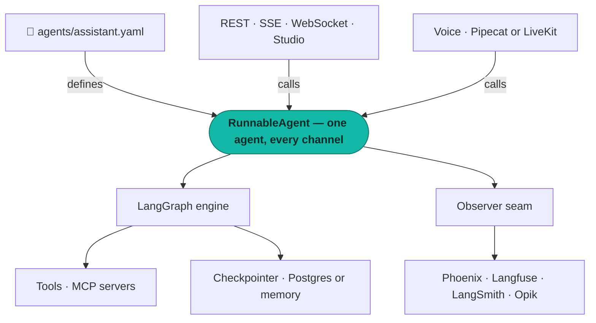

<div class="as-hero" markdown>

# Agents you can verify

<p class="as-tagline">Describe an agent in one YAML file. Serve it over REST, stream it, or
<strong>talk to it</strong> — same agent, same memory, same tools, same trace. Then run one
command and have the framework prove it does what it claims.</p>

[Get started](capabilities/foundation.md){ .md-button .md-button--primary }
[Browse the source](https://github.com/Agent-Ship/agent-ship){ .md-button }

</div>

<pre class="as-verify"><span class="as-cmd">$ agentship verify --agents-dir agents/</span>
<span class="as-rule">────────────────────────────────────────────────────</span>
  engine×capability grid ...... 11/11 <span class="as-ok">✓</span>
  spec validation ............. 10/10 <span class="as-ok">✓</span>
  observability span-tree ..... 4/4   <span class="as-ok">✓</span>
  service contracts ........... 9/9   <span class="as-ok">✓</span>
  A2A interop ................. <span class="as-skip">SKIPPED (no spec exposes a2a)</span>
<span class="as-rule">────────────────────────────────────────────────────</span>
  <span class="as-ok">→ all declared capabilities proven, 0 over-claims</span></pre>

Most frameworks *describe* what they support. This one checks. Every engine declares its
capabilities — streaming, tool calling, durability, human-in-the-loop — and a conformance
grid tries to catch it lying. An engine that claims durable resume but inherited the base
implementation **fails its own test suite**. That section marked `SKIPPED` is doing real
work too: nothing here reports a pass for something it did not actually run.

## One file is the whole agent

```yaml title="agents/assistant.yaml"
name: assistant
engine: langgraph
model: openai/gpt-4o-mini
prompt: Answer briefly and cite the tool you used.

tools: [calculator]                  # (1)!
mcp:
  filesystem:                        # (2)!
    transport: stdio
    command: npx
    args: ["-y", "@modelcontextprotocol/server-filesystem", "."]

voice:                               # (3)!
  stt: deepgram
  tts: cartesia
  endpoint_silence_ms: 700

observability:                       # (4)!
  exporters: [phoenix]
```

1. Built-in skills, or any `module:function` you write. A failing tool degrades the turn
   instead of killing it.
2. Any MCP server, local or remote. To the agent an MCP tool and a native one are
   indistinguishable — including when they fail.
3. Add this block and the same agent answers a microphone. Sixteen speech providers, named
   not imported.
4. One line, and every turn emits a full OpenTelemetry trace. Swap `phoenix` for `langfuse`,
   `langsmith` or `opik` without touching code.

```bash
agentship serve agents/          # REST + SSE + WebSocket + Studio
agentship voice serve agents/assistant.yaml   # ...or just talk to it
```

## What you get

<div class="grid cards" markdown>

-   :material-microphone: **Voice, in the same agent**

    ---

    Speak and be answered in **389 ms** to first audio, measured against an 850 ms budget
    by a test that fails if the pipeline stops streaming. Interrupt it mid-sentence and the
    conversation history records what you *heard*, not what it planned to say.

    [Voice →](capabilities/voice.md)

-   :material-chart-timeline-variant: **Traces that account for themselves**

    ---

    One interaction, one trace: agent → node → model → tool, with tokens, cost and latency.
    A spoken turn wraps the identical tree. Every backend proves delivery in CI, so an empty
    dashboard is attributable instead of a mystery.

    [Observability →](capabilities/observability.md)

-   :material-account-group: **Multi-agent without the framework**

    ---

    A supervisor built on plain `StateGraph` — no vendor abstraction between you and the
    graph. Members run in parallel, retry on failure, and appear in one trace tree.

    [Multi-agent →](capabilities/multi-agent.md)

-   :material-pause-circle: **Pause for a human, resume exactly**

    ---

    A node asks for approval and the run stops — over REST *and* over a stream, both handing
    back a token that genuinely resumes. Checkpointed per node, so a crash mid-run picks up
    where it stopped.

    [Checkpointing & HITL →](capabilities/checkpointing-and-hitl.md)

</div>

## How it fits together



The kernel imports no vendor. It owns the spec, the run contract, identity and the tracing
seam — and nothing else. Engines, speech providers, MCP servers and exporters all sit behind
it as swappable adapters, which is why changing any of them is a line of YAML rather than a
migration.

## Where it actually stands

Honest status, kept in step with the code by a rule: a capability is not done until its page,
its changelog entry and its decision record all land.

| Capability | Status |
|---|---|
| [Foundation & base classes](capabilities/foundation.md) | <span class="as-pill as-pill--pass">shipped</span> |
| [Engine & agent](capabilities/engine-and-agent.md) | <span class="as-pill as-pill--pass">shipped</span> |
| [Multi-agent supervisors](capabilities/multi-agent.md) | <span class="as-pill as-pill--pass">shipped</span> |
| [Checkpointing & HITL](capabilities/checkpointing-and-hitl.md) | <span class="as-pill as-pill--pass">shipped</span> |
| [Tools & MCP](capabilities/tools-and-mcp.md) | <span class="as-pill as-pill--pass">shipped</span> |
| [Observability](capabilities/observability.md) | <span class="as-pill as-pill--pass">shipped</span> |
| [Service & security](capabilities/service-and-security.md) | <span class="as-pill as-pill--pass">shipped</span> |
| [Voice](capabilities/voice.md) | <span class="as-pill as-pill--partial">shipped · LiveKit unproven live</span> |
| [Durable resume](capabilities/durable-resume.md) | <span class="as-pill as-pill--partial">seam only</span> |
| [Agent gateway / A2A](capabilities/agent-gateway-a2a.md) | <span class="as-pill as-pill--partial">partial</span> |
| Long-term memory | <span class="as-pill as-pill--open">not started</span> |

**Durable resume** is the one to read carefully: the seam is built and tested, but there is no
proof yet that a run killed mid-execution resumes to an identical result. That test exists and
is marked as expected-to-fail rather than deleted. **Voice on LiveKit** is unit-tested and has
never been run against a live room. Both are labelled this way everywhere, on purpose — the
whole point of a framework that checks its own claims is losing the right to round up.

## Why it is built this way

<div class="grid cards" markdown>

-   **Integrate, don't reinvent**

    ---

    LangGraph runs the graph. Pipecat moves the audio. OpenTelemetry carries the trace.
    We own the contract between them and nothing they already do well.

    [ADR 0001 →](decisions/0001-integrate-not-invent.md)

-   **Declare, don't fake**

    ---

    A capability is declared only once a conformance cell proves it. Structured output is
    switched off in the engine today for exactly this reason.

    [Verify & conformance →](capabilities/verify-and-conformance.md)

</div>

---

Install with `pip install agentship-sdk[langgraph]`, add `[voice]` to talk to it, and see
[the changelog](CHANGELOG.md) for what shipped when.
