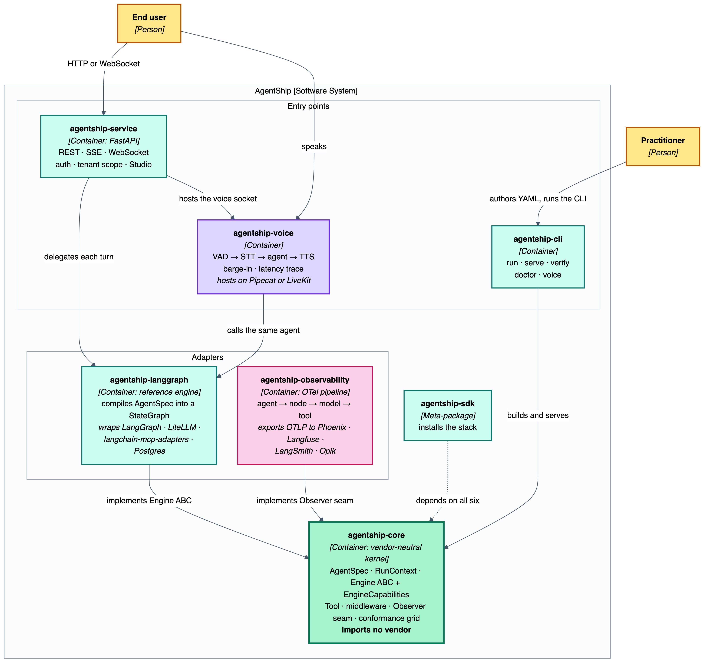
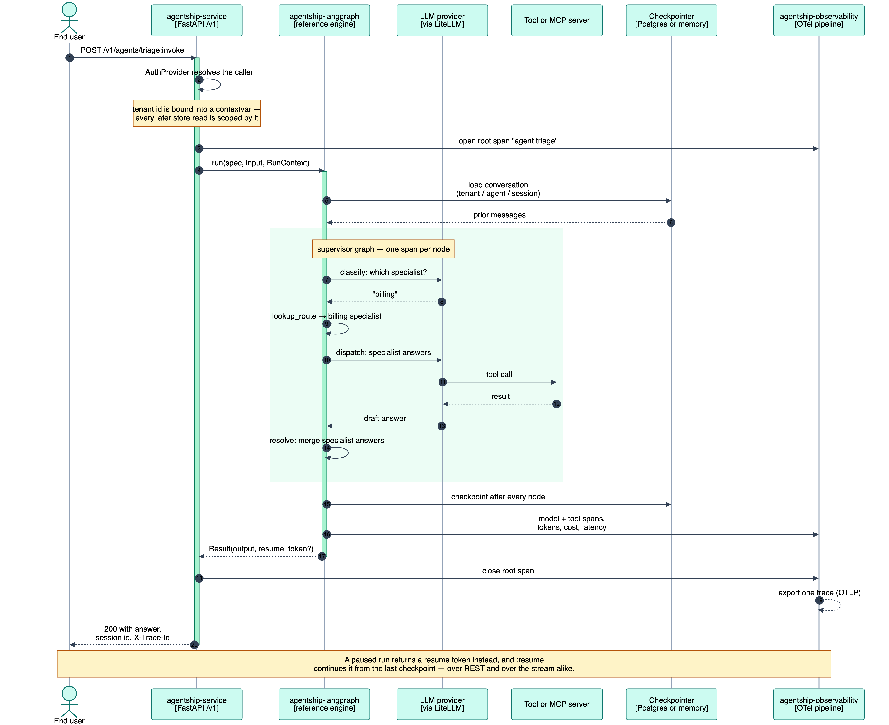

# Summary

`AgentShip` [@agentship_2026] is an open-source Python framework that turns the *agentic harness* — the set of components that surround a large language model in production, including model routing, tool calling, retrieval, memory, human-in-the-loop pauses, checkpointed durability, tracing, and a service surface — into a declarative artifact. A single `AgentSpec` YAML file names the components a practitioner wants and how they connect. `AgentShip` compiles the spec against a pluggable execution engine and wires the components behind it, replacing hand-written glue code and closed-source integrated platforms with a small, versionable definition.

The reference engine, `agentship-langgraph`, runs the compiled harness on LangGraph [@langgraph] and routes models through LiteLLM [@litellm]. Native Python tools and tools discovered from Model Context Protocol servers [@mcp] are bound through the same seam via `langchain-mcp-adapters` [@langchain_mcp_adapters]. Every turn emits a single OpenTelemetry [@otel] trace against the GenAI semantic conventions [@otel_genai], with exporters for Phoenix [@phoenix], Langfuse [@langfuse], and Opik [@opik] selected by editing one line of YAML. A FastAPI [@fastapi] service layer exposes each declared harness over `/v1` with pluggable authentication and per-tenant isolation. The `agentship verify` command executes an engine-by-capability grid to prove that each installed engine honors the capabilities it declares.

# Statement of need

A production agent is rarely a single library call. It is a *harness* — a composition of independently developed components: model routing, tools, a Model Context Protocol client, retrieval, memory, an observability pipeline, a checkpointer, a human-in-the-loop gate, and a service surface with authentication and tenant scoping. Each component has its own SDK and failure modes. Assembling them into a working service typically takes a practitioner weeks of glue code that must then be maintained as every underlying component evolves.

The two paths available today do not resolve this. Building the harness by hand every project is slow and rarely reused. Adopting a closed-source integrated platform such as Vertex AI Agent Builder [@vertex_agent_builder], Amazon Bedrock Agents [@bedrock_agents], Microsoft Copilot Studio [@copilot_studio], or LangGraph Platform [@langgraph_platform] shortens the path to a running system, but couples the harness to a single vendor's runtime, tracing backend, storage layer, and pricing model.

`AgentShip` was developed to give practitioners and researchers a third path: an open, declarative integration layer for the agentic harness. A single `AgentSpec` in YAML names the components and how they connect. The framework validates the composition against its target engine at build time, so a spec requesting `durability: checkpoint` from an engine that does not declare `durability` raises `CapabilityError` before `uvicorn` binds the port. It then compiles the harness into a running service over `/v1`.

The target audience is twofold. For platform teams building customer-facing agents at a fintech, healthtech, or B2B SaaS company, `AgentShip` collapses the plumbing phase from weeks to a versionable file. For researchers studying LLM-based agent systems [@wang2024survey; @peng2025survey], the same declarative surface removes the recurring cost of rewriting a service and observability layer for every experimental harness, so effort can shift from glue code to the research questions: agent behaviour, evaluation methodology, ablations across components, and comparative studies across engines. The design goal is that a new agentic harness is easier to declare than to program.

# State of the field

Tools available to a practitioner assembling an agentic harness fall into two categories. `AgentShip` fills the gap between them.

The first category is closed-source integrated platforms. Vertex AI Agent Builder [@vertex_agent_builder], Amazon Bedrock Agents [@bedrock_agents], Microsoft Copilot Studio [@copilot_studio], and LangGraph Platform [@langgraph_platform] each provide a hosted runtime bundling model routing, tool calling, observability, and a service surface behind a proprietary control plane. They deliver a working harness quickly, at the cost of vendor lock-in on runtime, tracing, checkpoint store, and pricing.

The second category is open-source components. `LangGraph` [@langgraph] is the low-level graph runtime that `AgentShip`'s reference engine compiles into. `AutoGen` [@autogen] and `CrewAI` [@crewai] target multi-agent conversation and role-driven crews. `Google ADK` [@google_adk] and `Pydantic AI` [@pydantic_ai] are code-first agent SDKs. `LlamaIndex` [@llamaindex] and `Semantic Kernel` [@semantic_kernel] are broader retrieval and skill orchestration frameworks. These components are valuable within their scope, but a practitioner using them still writes the integration layer that binds them together and exposes the result as a deployable service. `AgentShip`'s contribution is that integration layer, as an open, declarative artifact (\autoref{table:comparison}).

| Project                     | Category           | Open source        | Vendor lock-in    | Declarative harness   |
|-----------------------------|--------------------|--------------------|-------------------|-----------------------|
| **`AgentShip`**             | Integration layer  | Yes (Apache 2.0)   | None              | Yes — `AgentSpec` YAML |
| Vertex AI Agent Builder     | Integrated platform| No                 | Google Cloud      | Console + API         |
| Amazon Bedrock Agents       | Integrated platform| No                 | AWS               | Console + API         |
| Microsoft Copilot Studio    | Integrated platform| No                 | Microsoft 365     | Low-code UI           |
| LangGraph Platform          | Integrated platform| Partial            | LangChain runtime | Code-first            |
| LangGraph                   | OSS component      | Yes                | None              | No                    |
| CrewAI, AutoGen             | OSS components     | Yes                | None              | Partial (Python)      |
| Google ADK, Pydantic AI     | OSS SDKs           | Yes                | None              | No                    |
| LlamaIndex, Semantic Kernel | OSS orchestration  | Yes                | None              | Partial               |

Table: Positioning of `AgentShip` relative to closed-source integrated agent platforms and open-source component libraries. \label{table:comparison}

`AgentShip` is a standalone package because an integration layer is engine-neutral by construction. A declarative harness cannot live inside one engine, and a service surface consuming that spec must be defined outside every runtime it might be paired with. It depends on the LangGraph runtime, LiteLLM for model routing, `langchain-mcp-adapters` for the MCP client, and `sse-starlette` for the streaming wire behind the `Engine`, `Tool`, `Observer`, and `AuthProvider` abstract base classes defined in `agentship-core`.

# Software design

`AgentShip` is documented following the C4 model [@c4]. \autoref{fig:c4-context} shows the system in its environment; \autoref{fig:c4-container} decomposes it into installable packages; \autoref{fig:c4-dynamic} traces one turn end to end.


At the container level, `AgentShip` is a monorepo of six installable packages. `agentship-core` is the vendor-neutral kernel: `AgentSpec`, `RunContext`, the `Engine` abstract base class and its `EngineCapabilities` record, a vendor-neutral `Tool` type, and a middleware seam. `agentship-langgraph` is the reference engine that compiles an `AgentSpec` into a LangGraph `StateGraph`. `agentship-service` is the FastAPI [@fastapi] application that exposes each agent over `/v1`. `agentship-observability` is the OpenTelemetry pipeline behind the kernel's `Observer` seam. `agentship-cli` provides `agentship run`, `agentship serve`, and `agentship verify`. A meta-package, `agentship-sdk`, installs the batteries-included stack.



### The declarative surface

`AgentSpec` is the definition of a harness. It names the engine, the model routed through LiteLLM, a system prompt, native tools, a block of Model Context Protocol servers, an optional list of specialist members for a supervisor, and coarse-grained knobs (`streaming`, `durability`, `confirm_writes`, `observability`). The spec is a Pydantic model with `extra="forbid"`, and the framework performs coherence checks at build time. Requesting `confirm_writes: true` without `durability: checkpoint` raises `CapabilityError` during `AgentSpec.compile()`, before `uvicorn` binds the port. A team building a triage agent for a B2B SaaS support inbox writes:

```yaml
# triage.yaml
name: triage
engine: langgraph
model: openai/gpt-4o-mini
template: supervisor
durability: checkpoint
confirm_writes: true
observability:
  provider: otel
  exporters: [phoenix]
members:
  - name: billing
    ref: specialists/billing.yaml
    description: invoices, double charges, refunds
  - name: disputes
    ref: specialists/disputes.yaml
    description: chargebacks and payment disputes
  - name: kyc
    ref: specialists/kyc.yaml
    description: identity verification and onboarding
```

The harness is started with `agentship serve agents/ --auth api_key` and reached over HTTP:

```bash
curl -X POST http://127.0.0.1:8000/v1/agents/triage:invoke \
  -H "Authorization: Bearer $KEY" \
  -H "Content-Type: application/json" \
  -d '{"input": "My invoice looks wrong — who handles refunds?"}'
```

which returns a structured response:

```json
{
  "run_id": "01J8...",
  "output": "This is a billing question; routing to the billing specialist.",
  "route": "billing",
  "trace_id": "b2b0f4c1a9e34d..."
}
```

No orchestration code is written. Supervisor routing is a deterministic dictionary lookup over the `description:` fields, so that a resumed run reproduces byte-identical output; the OpenTelemetry trace referenced by `trace_id` is visible in Phoenix without further configuration.

### Tools and Model Context Protocol

Native tools and Model Context Protocol tools are bound through the same `Tool` seam. A native tool is a name, a description, an optional Pydantic argument schema, and a callable. A Model Context Protocol server is declared with a transport (`stdio` or `streamable_http`), a command or URL, and any headers; its tools are discovered at build time and registered against the same seam. The client itself is delegated to `langchain-mcp-adapters` [@langchain_mcp_adapters]. An optional `allowed_tools:` block bounds how many tools the model sees.

### The service surface

`agentship-service` mounts each declared harness at `/v1`: `POST /v1/agents/{name}:invoke` for structured JSON, `POST /v1/agents/{name}:stream` for Server-Sent Events, and `WS /v1/agents/{name}/live` for full-duplex streaming. Authentication is pluggable behind an `AuthProvider` seam: a `ForwardedHeaderAuthProvider` for gateway-verified identity, an `ApiKeyAuthProvider` for gateway-free deployments, and a JWT provider that validates against a JWKS endpoint via PyJWT. `TenantScope` binds the caller's `tenant_id` and `user_id` into a contextvar every store read consults, so cross-tenant access is a miss rather than a leak. SSE framing is delegated to `sse-starlette`.

### Observability and durability

Every turn of any harness emits one OpenTelemetry [@otel] trace: a root `agent` span wrapping `node.<name>` children, one `model` span carrying token counts and latency, and one `tool.<name>` span per tool call. Attributes follow the OpenTelemetry GenAI semantic conventions [@otel_genai] and the OpenInference [@openinference] vocabulary. Exporters for Phoenix [@phoenix], Langfuse [@langfuse], and Opik [@opik] are selected in one YAML line, while the kernel remains vendor-neutral through an `Observer` seam that `agentship-observability` implements. Durability is declared with `durability:` and delegated to LangGraph's `InMemorySaver` in-process or a Postgres-backed configuration for cross-process resume. `call_once` and canonical `idem_key` primitives make a resumed side-effecting tool call fire exactly once.

### Correctness discipline

A framework built on somebody else's runtime has to defend its own claims. `AgentShip` does this through two continuously-enforced disciplines. Every engine declares an `EngineCapabilities` record, and the shipped `agentship.conformance` module drives an engine-by-capability grid over every registered engine. A specification that requests a capability the target engine has not declared is rejected at build time with `CapabilityError`. The `agentship verify` command runs this grid offline and without provider keys, and additionally validates that every emitted Agent Card round-trips through the upstream A2A [@a2a] schema. This drift guard identified five real specification violations in `AgentShip`'s own wire models on first run (a missing required `Message.messageId`, a missing required `TaskStatusUpdateEvent.contextId`, an `apiKey` scheme lacking `in` and `name`, an `oauth2` scheme lacking an `OAuthFlows` object, and a mistaken `mtls` scheme whose A2A `type` should have been spelled `mutualTLS`) and would flag any future divergence.

### One turn end to end

\autoref{fig:c4-dynamic} traces a single request against the `triage.yaml` harness. A `POST /v1/agents/triage:invoke` arrives at `agentship-service`. The configured `AuthProvider` resolves the caller, and `TenantScope` binds the tenant identity into a contextvar every downstream store read consults. The runtime publishes the per-turn `RunContext` and delegates to `agentship-langgraph`, which drives the supervisor graph. `classify` calls the model. `lookup_route` resolves the specialist by dictionary lookup. `dispatch` runs the chosen specialist, which may be a local agent or a remote agent reached over A2A. `resolve` merges answers through a pure `ConflictResolver`. When `confirm_writes` is set, any side-effecting tool pauses at `interrupt()` and the run returns a resume token. The checkpointer saves state after every node; the observer emits one OpenTelemetry trace.



# Research impact statement

`AgentShip` is intended to remove the recurring cost of building an agentic harness from the critical path of practitioner and research work. For a platform team, this collapses a multi-week service-scaffolding phase into a versionable YAML file, so effort accrues to the domain problem rather than to the plumbing. For a researcher studying LLM-based agents, the same declarative surface enables comparative and ablation studies that are difficult today: swapping a checkpointer, an observability exporter, a Model Context Protocol server, an authentication scheme, or a supervisor's specialist set is a change to a YAML block rather than a fork of a service repository. Re-running an experimental harness under a different execution engine — once a second engine adapter lands — is a one-line spec change. The shipped `agentship verify` conformance grid is intended to serve as a reproducible substrate for cross-framework capability benchmarks.

`AgentShip` is organised as six installable packages and can be installed with `pip install agentship-sdk` for the batteries-included stack. The project ships an MkDocs [@mkdocs] documentation site, a GitHub Actions workflow that runs the automated test suite and lints every push, a separate daily job that re-exercises the suite against real providers to catch upstream drift, a `Dockerfile` and `docker-compose.yml` for reproducible local runs, and runnable examples under `examples/`, including a keyless `echo` engine so `agentship run examples/hello.yaml` works with no provider credentials.

Two boundaries of the current release are named upfront. First, an in-process resume test against LangGraph's `InMemorySaver` demonstrates that a rebuilt engine resumes to identical output, and the `call_once` ledger proves exactly-once behaviour for a single side-effecting tool call. The fully integrated proof — a supervisor with `durability: checkpoint` interrupted mid-run and resumed across processes on a Postgres-backed saver, with exactly-once semantics across specialist boundaries — is the outstanding `durable_resume_after_kill` conformance cell and is documented as a known gap. Second, the framework ships with one production engine (LangGraph) and a keyless `echo` engine that tests the vendor-neutral kernel; adapters for Google ADK and Pydantic AI are planned but not yet released, so multi-engine portability is a claim the framework is designed to accommodate rather than one demonstrated at scale.

# AI usage disclosure

Portions of the codebase and this manuscript were drafted with the assistance of large language models. Every contribution was reviewed, edited, and verified by the author, and every technical claim was checked against the repository at the tagged release.

# Acknowledgements

The design leans on the work of the LangGraph and LangChain maintainers [@langgraph; @langchain; @langchain_mcp_adapters], the LiteLLM contributors [@litellm], the Model Context Protocol maintainers at Anthropic [@mcp], the Agent-to-Agent protocol working group [@a2a], the OpenTelemetry GenAI SIG [@otel; @otel_genai], the OpenInference project at Arize AI [@openinference; @phoenix], the Langfuse team [@langfuse], the Opik team [@opik], and the FastAPI [@fastapi] and Pydantic [@pydantic] communities.

# References
